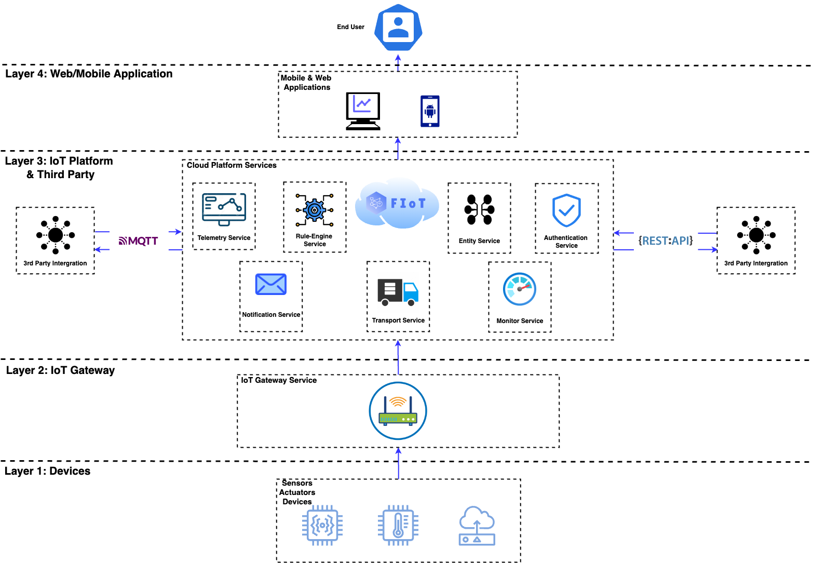
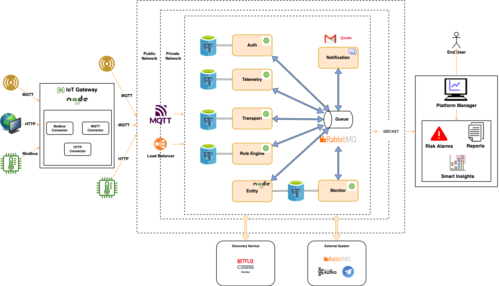
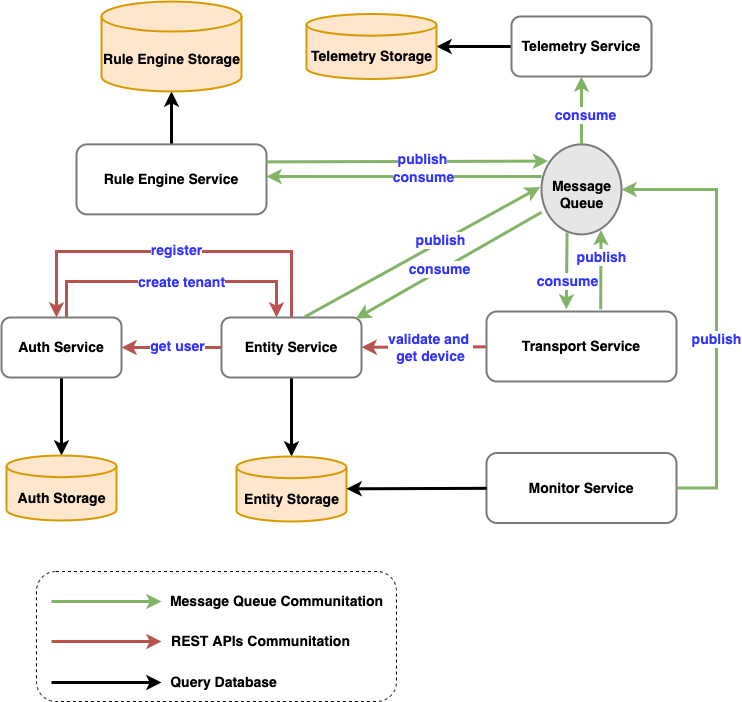
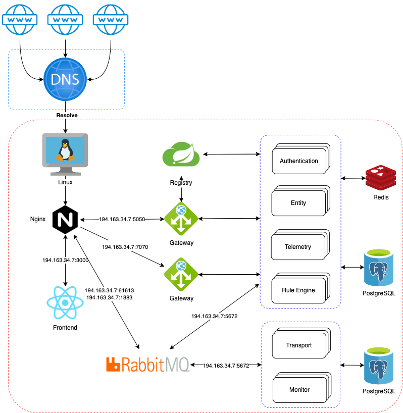
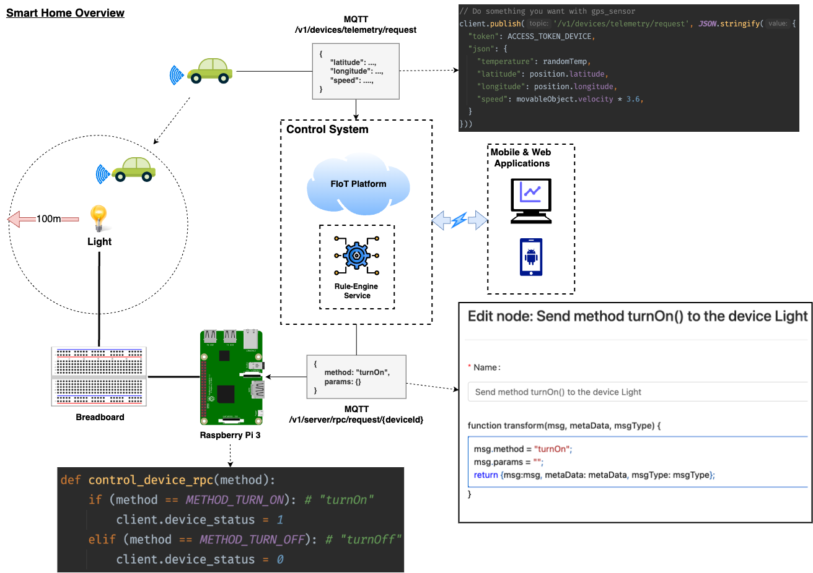

# Technologies

* <b>Front-End</b>: ReactJS, Ant Design.
* <b>Back-End</b>: NodeJS, Spring Boot, Nashorn JS Engine, Actor Model.
* <b>Database</b>: PostgreSQL, Redis.
* <b>Architecture</b>: Micro-services.
* <b>Security</b>: JWT, Authorization, Authentication.
* <b>Transport Network</b>: RabbitMQ, HTTP, MQTT, Modbus.

# Architecture
## Overview IoT System

* <b>Layer 1 (Devices and Sensors)</b>
* <b>Layer 2 (IoT Gateway)</b>
* <b>Layer 3 (IoT Platform)</b>
* <b>Layer 4 (Mobile/Web Application)</b>

## High Level Design

## Internal Domain Communication

## Deployment Diagram

## Demo
### Overview scenario demo

### Video demo
[https://drive.google.com/file/d/1wdIJG6jdPy86NNML0GSmc0ZF3hW9Xgld/view](https://drive.google.com/file/d/1wdIJG6jdPy86NNML0GSmc0ZF3hW9Xgld/view)
